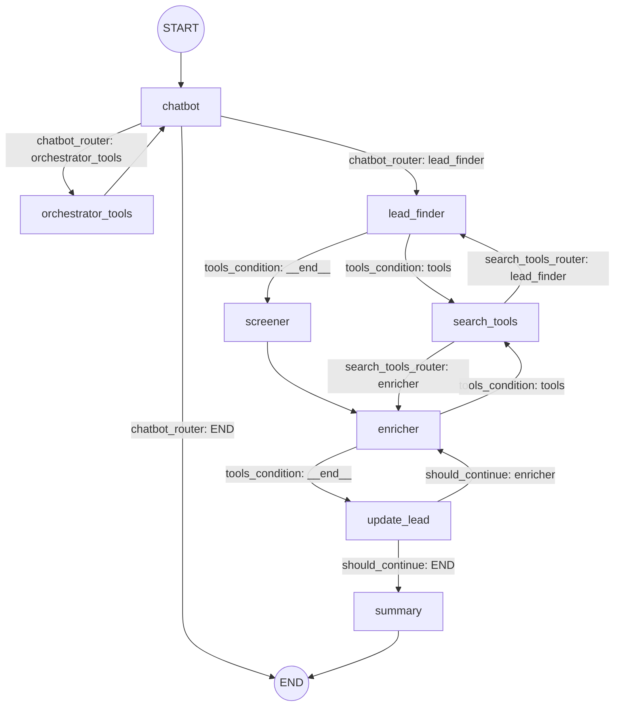

## Agentic Sales Engine (B2B Agent)

Agentic Sales Engine is a multi-agent workflow that helps you **find, qualify, enrich, and summarize B2B leads** using an LLM + tool-driven execution (LangGraph). It’s designed to be a practical foundation for an “agentic sales copilot” that can also **remember** past interactions and (soon) support **agentic RAG** over previously qualified leads.

---

## The problem this repo solves

Sales/BD workflows usually involve repetitive steps:

- Define an Ideal Customer Profile (ICP)
- Find candidate companies that match the ICP
- Filter/qualify leads
- Enrich missing fields (website, financials, signals, contacts)
- Summarize findings for action

This project automates that workflow with a **graph-based multi-agent system** and pluggable tools (web search, memory, ICP retrieval).

---

## What it does today (current features)

- **Graph-based multi-agent workflow (LangGraph)**
  - Orchestrator routes user intent to the correct node(s)
  - Lead finder generates leads aligned to the ICP
  - Screener filters leads
  - Enricher fills missing fields using web search
  - Summary produces a readable report

- **Short-term memory / checkpointing (Redis)**
  - Uses a Redis-backed checkpointer to persist graph state per thread.

- **Long-term memory (Mem0)**
  - Saves user+assistant turns into Mem0 and allows searching past memories.

- **Web search tool integration**
  - Uses Serper (GoogleSerper) via a `search_company_info` tool to enrich leads or answer direct “one company” questions.

- **Gradio UI**
  - Simple chat interface with thread id support for continuity.

---

## Architecture overview

Folder structure (high level):

```text
b2b_agent/
├── main.py                         # Composition root + app entrypoint
├── src/
│   ├── application/                # Core workflow (LangGraph), agents, tools, schemas
│   │   ├── agents/                 # Orchestrator, lead finder, screener, enricher, summary
│   │   ├── graphs/                 # LangGraph builder + nodes/edges wiring
│   │   ├── prompts/                # Prompt storage/versioning (Work in progress)
│   │   ├── schema/                 # Pydantic models (State, Lead, ICP, Contact)
│   │   ├── security/               # Input validation / sanitization (Work in progress)
│   │   └── tools/                  # Tools: ICP retrieval, web search, memory search
│   ├── domain/                     # Domain rules & routing conditions (lightweight today)
│   │   └── conditions/             # Routers / enrichment continuation checks
│   ├── infrastructure/             # External integrations + persistence
│   │   ├── clients/                # External API clients (e.g., Serper web search)
│   │   └── memory/                 # Short/long-term memory implementations
│   └── presentation/               # UI layer (Gradio)
│       └── api/                    # Gradio app wrapper
├── docs/                           # Architecture, prompts, metrics documentation (WIP)
└── tests/                          # Unit/integration/e2e scaffolding (WIP)
```

Key idea: `main.py` wires dependencies; `application/` owns the workflow; `infrastructure/` owns external services; `presentation/` owns UI.

---

## LangGraph workflow diagram



---

## How the workflow runs (high level)

1. User message enters the graph.
2. Orchestrator routes:
   - If user wants company info, it can use search tools directly.
   - If user wants lead generation, it triggers ICP retrieval (if needed) then lead finding.
3. Lead finder produces leads.
4. Screener filters them.
5. Enricher uses search to fill missing fields.
6. Leads are updated, then summarized.

---

## Getting started

### Requirements

- Python 3.11+
- Redis (for LangGraph checkpointing)
- API keys:
  - `OPENAI_API_KEY` (LLM)
  - `SERPER_API_KEY` (web search)
  - `MEM0_API_KEY` (long-term memory)

### Environment variables

- `REDIS_URI` (required) – Redis connection string
- `APP_PORT` or `PORT` (optional) – server port (default: 7860)
- `OPENAI_API_KEY`
- `SERPER_API_KEY`
- `MEM0_API_KEY`

### Run locally

Install deps (using `uv` if you want to match Docker):

uv sync
uv run python main.py
