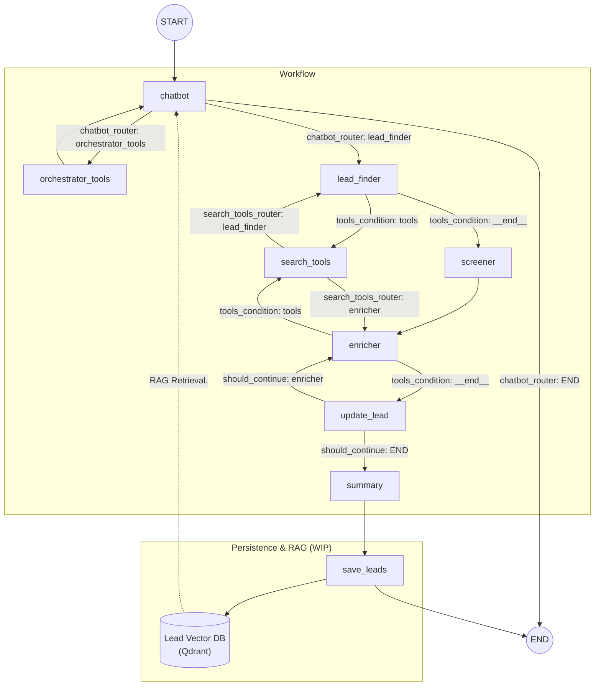

## Agentic Sales Engine (B2B Agent)

Agentic Sales Engine is a multi-agent workflow that helps you **find, qualify, enrich, and summarize B2B leads** using an LLM + tool-driven execution (LangGraph). It’s designed to be a practical foundation for an “agentic sales copilot” that can also **remember** past interactions and (soon) support **agentic RAG** over previously qualified leads.

---

## The problem this repo solves

Sales/BD workflows usually involve repetitive steps:

- Define an Ideal Customer Profile (ICP)
- Find candidate companies that match the ICP
- Filter/qualify leads
- Enrich missing fields (website, financials, signals, contacts)
- Summarize findings for action

This project automates that workflow with a **graph-based multi-agent system** and pluggable tools (web search, memory, ICP retrieval).

---

## What it does today (current features)

- **Graph-based multi-agent workflow (LangGraph)**
  - Orchestrator routes user intent to the correct node(s)
  - Lead finder generates leads aligned to the ICP
  - Screener filters leads
  - Enricher fills missing fields using web search
  - Summary produces a readable report

- **Short-term memory / checkpointing (Redis)**
  - Uses a Redis-backed checkpointer to persist graph state per thread.

- **Long-term memory (Mem0)**
  - Saves user+assistant turns into Mem0 and allows searching past memories.

- **Web search tool integration**
  - Uses Serper (GoogleSerper) via a `search_company_info` tool to enrich leads or answer direct “one company” questions.

- **Gradio UI**
  - Simple chat interface with thread id support for continuity.

---

## Architecture overview

Folder structure (high level):

```text
b2b_agent/
├── main.py                         # Composition root + app entrypoint
├── src/
│   ├── application/                # Core workflow (LangGraph), agents, tools, schemas
│   │   ├── agents/                 # Orchestrator, lead finder, screener, enricher, summary
│   │   ├── graphs/                 # LangGraph builder + nodes/edges wiring
│   │   ├── prompts/                # Prompt storage/versioning (Work in progress)
│   │   ├── schema/                 # Pydantic models (State, Lead, ICP, Contact)
│   │   ├── security/               # Input validation / sanitization (Work in progress)
│   │   └── tools/                  # Tools: ICP retrieval, web search, memory search
│   ├── domain/                     # Domain rules & routing conditions (lightweight today)
│   │   └── conditions/             # Routers / enrichment continuation checks
│   ├── infrastructure/             # External integrations + persistence
│   │   ├── clients/                # External API clients (e.g., Serper web search)
│   │   └── memory/                 # Short/long-term memory implementations
│   └── presentation/               # UI layer (Gradio)
│       └── api/                    # Gradio app wrapper
├── docs/                           # Architecture, prompts, metrics documentation (WIP)
└── tests/                          # Unit/integration/e2e scaffolding (WIP)
```

Key idea: `main.py` wires dependencies; `application/` owns the workflow; `infrastructure/` owns external services; `presentation/` owns UI.

---

## LangGraph workflow diagram



---

## How the workflow runs (high level)

1. User message enters the graph.
2. Orchestrator routes:
   - If user wants company info, it can use search tools directly.
   - If user wants lead generation, it triggers ICP retrieval (if needed) then lead finding.
3. Lead finder produces leads.
4. Screener filters them.
5. Enricher uses search to fill missing fields.
6. Leads are updated, then summarized.

---

## Getting started

### Requirements

- Python 3.11+
- Redis (for LangGraph checkpointing)
- API keys:
  - `OPENAI_API_KEY` (LLM)
  - `SERPER_API_KEY` (web search)
  - `MEM0_API_KEY` (long-term memory)

### Environment variables

- `REDIS_URI` (required) – Redis connection string
- `APP_PORT` or `PORT` (optional) – server port (default: 7860)
- `OPENAI_API_KEY`
- `SERPER_API_KEY`
- `MEM0_API_KEY`

### Run locally

#### 1) Set environment variables

Create a `.env` file in the repo root (recommended) with at least:

- `OPENAI_API_KEY`
- `SERPER_API_KEY`
- `MEM0_API_KEY`
- `REDIS_URI` (example: `redis://localhost:6379/0`)

Optionally:

- `APP_PORT` or `PORT` (defaults to `7860`)

#### 2) Start dependencies (Redis)

If you already have Redis running, skip this step.

Using Docker (Redis only):

```bash
docker run --rm -p 6379:6379 redis:7
```

Or using the repo `docker-compose.yaml` (Redis + optional Qdrant + optional RedisInsight):

```bash
docker compose up -d redis-database
```

#### 3) Install dependencies

Using `uv` (recommended; matches the Docker build):

```bash
uv sync
```

Or using `pip`:

```bash
pip install -e .
```

#### 4) Run the app

```bash
uv run python main.py
```

#### 5) Open the UI

Open `http://localhost:7860` (or your configured `PORT`/`APP_PORT`).

#### Troubleshooting

- **`REDIS_URI is not set`**: add `REDIS_URI=redis://localhost:6379/0` to your `.env`.
- **Redis connection errors**: confirm Redis is running and reachable from your environment.
- **Search tool returns empty**: check `SERPER_API_KEY`.

---

## Docker

A Dockerfile is included. It runs `python main.py` and exposes port 7860.

```bash
docker build -t b2b-agent .
docker run -p 7860:7860 --env-file .env b2b-agent
```

---

## Work in progress (planned features)

The items below are intentionally written as if they exist, but are marked as **Work in progress**.

- **Security Guardrails (Work in progress)**
  - Centralized input validation, prompt injection resistance, and tool-usage constraints.
  - Stronger “allowed actions” enforcement across agents (not only via prompts).

- **Prompt versioning and prompt storage (Work in progress)**
  - Versioned prompts per agent in `src/application/prompts/`
  - Change history and release process (e.g., semantic versioning for prompt templates)
  - Prompt evaluation snapshots tied to versions

- **Agentic RAG over qualified leads and past interactions (Work in progress)**
  - Persist qualified/enriched leads into a vector database (e.g., Qdrant)
  - Provide a `search_leads` tool so users can query the existing lead knowledge base:
    - “Show me fintech leads we already found”
    - “Which leads have revenue > $10M?”
  - Use retrieval in orchestration to avoid duplicate enrichment and improve answers

- **Evals & quality gates (Work in progress)**
  - Offline evals for:
    - Lead relevance to ICP
    - Enrichment accuracy (no hallucinated contacts)
    - Routing correctness (company info vs lead gen)
  - Regression suite tied to prompt versions and tool changes

- **Observability & metrics (Work in progress)**
  - Tracing per node/tool call
  - Latency, token usage, tool call counts, failure rates
  - Export to a metrics backend and add dashboards under `docs/metrics/`

- **MCP (Model Context Protocol) integrations (Work in progress)**
  - Use MCP servers for first-class integrations (e.g., Google Workspace, CRMs)
  - Standardize external tool interfaces and auth/scopes

---

## Disclaimer

This project uses LLMs and external tools. Treat outputs as **assistance**, not ground truth. Always verify critical business data.
